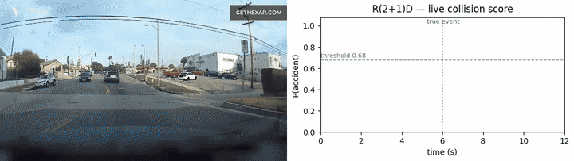

# Dashcam Collision Detection — Edge (Jetson + Rockchip)

Real-time **temporal** accident detection on dashcam video: it detects ***when*** a
collision happens, not just whether a clip contains one. A short **causal window**
slides across the stream to produce a `P(accident)`-over-time curve; the crash is
flagged the moment the curve stays high. Trained on the **Nexar Collision
Prediction** dataset and exported **PyTorch → ONNX → TensorRT (Jetson Orin)** /
**→ RKNN (Rockchip RK3588)**.

- **Model #1 — NVIDIA Jetson Orin** — ✅ trained, evaluated, ONNX-exported (on-device
  TensorRT build is the only remaining step).
- **Model #2 — Rockchip RK3588** — ✅ built & trained (2D-CNN + temporal head; split
  static-shape ONNX export ready). On-device INT8 RKNN benchmark is the remaining step.

## 🎬 See it in action



A held-out Nexar dashcam clip (left) and the model's **live `P(accident)` score**
(right) as a 1-second causal window slides across it. The score stays near zero
through normal driving, then spikes the instant the collision unfolds (~19.1 s, the
dotted *true event* line), crosses the `0.68` threshold and **fires a detection within
~0.1 s** of the labelled time — with no false alarms beforehand. This is exactly the
streaming computation the edge device runs on a live camera.

> Reproduce: `python -m tools.demo_gif make --id 00168 --out assets/demo.gif`

## 📦 Models (Hugging Face Hub)

Pretrained ONNX weights are hosted on the Hub (each repo includes `model.onnx`, a
`model.meta.json` inference sidecar, and a model card):

| Model | Best for | 🤗 Hub |
|---|---|---|
| **VideoMAE-base + HNM** ⭐ | accuracy-first | [akhra92/dashcam-collision-jetson-videomae-hnm](https://huggingface.co/akhra92/dashcam-collision-jetson-videomae-hnm) |
| **R(2+1)D-18** | lightweight / Orin Nano | [akhra92/dashcam-collision-jetson-r2plus1d18](https://huggingface.co/akhra92/dashcam-collision-jetson-r2plus1d18) |

```python
from huggingface_hub import hf_hub_download
onnx = hf_hub_download(repo_id="akhra92/dashcam-collision-jetson-r2plus1d18", filename="model.onnx")
```

## 🔴 Live demo


Upload a dashcam clip — or click **“Try it with a sample accident clip”** — and watch
the `P(accident)` curve and the detected collision time. The hosted demo runs the
**R(2+1)D** model via ONNXRuntime on CPU (torch-free).

**Run locally**
```bash
pip install -r requirements.txt
streamlit run app.py        # uses artifacts/runs/jetson_r2plus1d18/...onnx if present
```
---

## 1. The idea (mental model)

The model never sees a whole video at once. It classifies a **1-second causal clip**
("window" = 16 frames @ 16 fps, ending at "now") as *accident* vs *normal*. Sliding
that window over the video gives a probability curve; a **detection fires** when
`consec=3` consecutive windows exceed a threshold. This is exactly the streaming
computation an edge device runs on a live camera.

> A training **sample is a window, not a video** — one 40 s clip yields many windows.

**What makes it temporal (not scene-level):** negatives include the *normal-driving
portions of accident videos*, so the model must tell "this same road 3 s before the
crash" (negative) from "the crash unfolding" (positive) — it learns the *event*, not
the *scene*. For a window whose **end time** is `t`, in an accident video with event
`e`:

| window end-time `t` | label |
|---|---|
| `e − 1.0s ≤ t ≤ e + 0.5s` | **positive** |
| `e + 0.5s < t ≤ e + 2.5s` | ignored (ambiguous aftermath) |
| otherwise (and all of any non-accident video) | **negative** |

A detection is **correct** if it fires within **±1.0 s** of `time_of_event`.

---

## 2. Results

Held-out **225-video** validation split (112 accident / 113 normal), scored by
streaming over the **full ~40 s videos** (`src/eval_fullvideo.py`) — the realistic
deployment condition. Identical data/pipeline across models.

**Model #1 — Jetson Orin** (3D-CNN / ViT over the window):

| Model | Detection @ low-FAR | False-alarm floor | Loc. error | Size |
|---|---|---|---|---|
| **VideoMAE-base + HNM** ⭐ best accuracy | **65.2 %** @ 8.8 % (or 68.8 % @ 13 %) | **8.8 %** | **0.31 s** | 86 M ViT @224 |
| R(2+1)D-18 — lightweight | 63.4 % @ 14.2 % | ~8 % | 0.31 s | 33 M CNN @112 |
| VideoMAE-base (no HNM) | — (floor 24 %) | 23.9 % | 0.42 s | 86 M ViT @224 |

**Model #2 — Rockchip RK3588** (2D-CNN per frame + temporal head; no 3D convs):

| Model | Detection @ low-FAR | Loc. error | Size |
|---|---|---|---|
| **resnet18 + motion** ⭐ best on NPU | **30 %** @ 13 % (or 26 % @ 8 %) | 0.38 s | 12 M 2D-CNN @112 |
| resnet18_temporal (RGB only) | 18 % @ 12 % | 0.34 s | 12 M |
| mnv3s_temporal (RGB only) | 22 % @ 14 % | 0.36 s | 1.6 M |

The RK3588 models trail the 3D models (~30 % vs ~63 % detection): a per-frame 2D CNN
sees *appearance* but not the *motion* a collision is made of. Feeding explicit
**temporal-difference channels** (`input.motion`) roughly doubled detection over the
RGB-only 2D model — motion modelling, not backbone size, is the bottleneck. This is
the accuracy cost of dropping 3D convs to fit the NPU.

**Recommendation**
- **Accuracy-first (Jetson):** `videomae_base + HNM` — most accurate at every
  false-alarm level. Caveat: heavy ViT; **verify per-window latency on the actual
  Orin** before committing.
- **Lightweight (Jetson Orin Nano):** `r2plus1d_18` — far faster, ~5 pts lower detection.
- **Rockchip RK3588:** `resnet18 + motion` — best NPU-deployable accuracy; `mnv3s` if
  NPU latency is tight (13× fewer params, ~8 pts lower detection).

**Key engineering lessons (baked into the configs)**
1. **Full-timeline hard negatives** (sampling normal windows across the *whole* video,
   `src/extract_negatives.py`) are essential — without them the model only learns
   "normal" from an 8 s strip and false-alarms on long streams.
2. **Select the checkpoint by validation AP on a set that includes those hard
   negatives** (`monitor: val_ap`). Selecting by AUC on near-event windows picks an
   undertrained early epoch that false-alarms badly.
3. **Hard-negative mining** (`src/mine_hard_negatives.py`): run a trained model over
   all videos, collect the normal clips it false-fired on, fine-tune with them
   oversampled. This dropped VideoMAE's false-alarm floor 23.9 % → 8.8 %, halved
   window-level false positives, and tightened localization.
4. Always judge the operating point with `eval_fullvideo` (full videos), never the
   optimistic 8 s-strip `evaluate`.

The `detect_threshold` (tuned on the full-video curve) is stored in `best.pt` and the
ONNX `.meta.json`; raise it to trade detection for fewer false alarms.

---

## 3. Architecture

Three backbone families behind one interface (`src/model.py`), all output a single
logit per window:

| `model.arch` | Type | Input | Params | Notes |
|---|---|---|---|---|
| `r2plus1d_18` (default) | 3D-CNN | 16×112×112 | 33 M | factorized (2+1)D convs; lightest, cleanest TensorRT export |
| `s3d`, `mc3_18`, `r3d_18` | 3D-CNN | 16×112–224 | 8–33 M | lighter/alt CNNs |
| `videomae_base` | ViT (VideoMAE) | 16×224×224 | 86 M | self-supervised; highest accuracy; needs `transformers==4.46.3` |
| `videomae_large`, `videomaev2_base` | ViT | 16×224×224 | 300/86 M | heavier / VideoMAE-v2 |
| `mnv3s_temporal` (Rockchip) | 2D-CNN/frame + temporal head | 16×112×112 | ~1.6 M | **no 3D convs** → RK3588 NPU; head = `tconv`/`gru`/`tpool` |
| `mnv3l_temporal`, `resnet18_temporal` | 2D-CNN/frame + temporal head | 16×112×112 | 4–12 M | larger 2D backbones |

The 2D-CNN family takes an optional `input.motion: true`, which feeds the backbone
6 channels — RGB **plus** the per-frame temporal difference — so it perceives motion
without 3D convs (the single biggest accuracy lever for the RK3588 model).

Common training: transfer learning, dropout + single logit, `BCEWithLogitsLoss` with
`pos_weight`, discriminative LR, backbone-freeze warmup, cosine LR + warmup, AMP,
label smoothing, spatial + temporal-jitter augmentation; best checkpoint by val AP.

### Why two different models for the two devices

| | Jetson Orin (Model #1) | Rockchip RK3588 (Model #2) |
|---|---|---|
| Accelerator | Ampere GPU + TensorRT | NPU (6 TOPS) + RKNN toolkit2 |
| 3D convolutions | ✅ supported | ❌ poorly supported |
| Architecture | **3D-CNN / ViT** over the window | **2D-CNN per frame + temporal head** |
| Export | PyTorch → ONNX → TensorRT | PyTorch → ONNX → RKNN |

The detection *framing* (sliding window → curve → fire time) is identical; only the
per-window classifier differs.

---

## 4. How the pipeline works

**Data-shape journey (one line each):**
```
MP4 (1280×720, 30fps, ~40s)
  ├─[preprocess.py]       → strip .npy   [128,128,128,3] uint8  (8s @16fps around the event, 128² crop)
  ├─[extract_negatives.py]→ neg .npy     [256,128,128,3] uint8  (16 full-timeline negative clips)
  │   └─[enumerate_windows] → window      start_idx + temporal label
  │       └─[WindowDataset] → tensor      [3,16,112,112] float   (aug + Kinetics/VideoMAE normalize)
  │           └─[model]     → logit       → sigmoid → P(accident)
  │               └─[slide over video] → curve [(t,p),…]
  │                   └─[detect()] → "ACCIDENT at t=19.3s"
  └─ export: model → .onnx + .meta.json   (device-neutral; parity-checked vs ONNXRuntime)
        ├─ Jetson:   .onnx →[trtexec, on-device] → .engine (FP16/INT8)
        └─ Rockchip: 2D-CNN+temporal .onnx →[rknn-toolkit2, x86] → .rknn (INT8)
```

- **Preprocessing** decodes each MP4 once into small uint8 strips (training reads
  16-frame slices, not 720p video). Positive strips are centered on the collision;
  negative strips are random. Uniform 16 fps means strip-frame *j* maps to time
  `start + j/16`, which is how windows get time labels.
- **Split** is stratified **at the video level** (85/15, seed 42) so windows from one
  clip never straddle train/val.
- **Three evaluation views:** window-level (classifier AUC/AP), strip-level temporal
  (fast, optimistic), and full-video streaming (`eval_fullvideo`, the real metric).
- The Kaggle `dataset/test/` clips are **unlabeled** — all accuracy numbers come from
  the held-out 15 % of the labeled training set.

---

## 5. Setup

- **Training PC:** RTX 4060 (8 GB), conda env `myenv` (Python 3.11, torch 2.5.0+cu124,
  torchvision 0.20).
  ```bash
  conda activate myenv
  pip install -r requirements-train.txt
  ```
- **Jetson Orin:** JetPack already provides CUDA/cuDNN/TensorRT (don't pip-install
  them). `pip install -r deploy/jetson/requirements-jetson.txt`.

Run all module commands from the project root with `python -m …`.

---

## 6. Reproduce (Model #1)

```bash
# 1. Data prep (once)
python -m src.preprocess        --config configs/jetson_r2plus1d.yaml --split train
python -m src.extract_negatives --config configs/jetson_r2plus1d.yaml

# 2. Train + evaluate the lightweight R(2+1)D model
python -m src.train          --config configs/jetson_r2plus1d.yaml
python -m src.eval_fullvideo  --config configs/jetson_r2plus1d.yaml   # realistic metric
python -m src.detect_video    --config configs/jetson_r2plus1d.yaml --video dataset/train/00822.mp4

# 3. (Optional, best accuracy) VideoMAE + hard-negative mining
#    First extract the 224px data, then train the base model:
python -m src.preprocess        --config configs/jetson_videomae.yaml --split train
python -m src.extract_negatives --config configs/jetson_videomae.yaml
python -m src.train             --config configs/jetson_videomae.yaml
#    Mine the clips it false-fires on, then fine-tune from those weights:
python -m src.mine_hard_negatives --config configs/jetson_videomae.yaml \
    --mine-threshold 0.85 --max-per-video 12 --stride 4
python -m src.train          --config configs/jetson_videomae_hnm.yaml
python -m src.eval_fullvideo  --config configs/jetson_videomae_hnm.yaml

# 4. Export the chosen model to ONNX (parity-checked)
python -m src.export_onnx --config configs/jetson_videomae_hnm.yaml   # or jetson_r2plus1d
```

---

## 7. Deployment

### Jetson Orin (TensorRT) — runs **on the device**
TensorRT engines are hardware/version-specific, so they **must** be built on the
Jetson, not on the training PC. Copy the `.onnx` + `.meta.json` over, then:
```bash
# build the engine
chmod +x deploy/jetson/build_engine.sh
./deploy/jetson/build_engine.sh model.onnx fp16            # FP16 (recommended)
# optional INT8 (~2× faster — copy a few hundred .npy clips for calibration)
python3 deploy/jetson/int8_calibrator.py --onnx model.onnx --clips ./calib_clips --out model_int8.engine

# streaming inference + latency benchmark
python3 deploy/jetson/infer_trt.py --engine model_fp16.engine \
    --video some_clip.mp4 --meta model.meta.json --dump-curve curve.csv
```
**Sign-off:** compare the PyTorch (`detect_video`) and TensorRT prob curves on the
same clips — they should agree within FP16 tolerance and fire at the same time — and
confirm per-window latency meets your streaming budget.

### Rockchip RK3588 (RKNN) — Model #2
The RK3588 NPU doesn't support 3D convolutions, so this is a **different model**: a
**2D-CNN per frame** (MobileNetV3 / ResNet18, `src/model.py`) + a lightweight
**temporal head** (1D-conv / GRU / pool). The best variant also feeds **temporal-
difference channels** (`input.motion`) so the 2D backbone sees motion. Same temporal
framing and training pipeline (it **reuses the 128 px strips** — no re-preprocessing).

It **deploys as two graphs**: the per-frame 2D backbone runs on the NPU (INT8); the
tiny temporal head runs on the device CPU. This keeps every NPU tensor 4D.

```bash
# 1. Train (reuses artifacts/clips from Model #1). Recommended = resnet18 + motion.
python -m src.train --config configs/rockchip_resnet18_motion.yaml
python -m src.eval_fullvideo --config configs/rockchip_resnet18_motion.yaml

# 2. Export the split, static-shape ONNX graphs (parity-checked vs PyTorch)
python -m src.export_rockchip --config configs/rockchip_resnet18_motion.yaml
#    -> backbone.onnx [1,6,112,112]->[1,C] + temporal_head.onnx [1,T,C]->[1] + meta
#    (3 input channels for the RGB-only configs; 6 with input.motion)

# 3. On an x86 host: quantize the backbone to INT8 RKNN (rknn-toolkit2)
python deploy/rockchip/convert_rknn.py --backbone backbone.onnx \
    --meta rockchip.meta.json --strips artifacts/clips/train --out backbone.rknn

# 4. On the RK3588: stream (NPU backbone + CPU head) + benchmark
python3 deploy/rockchip/infer_rknn.py --backbone backbone.rknn \
    --head temporal_head.onnx --meta rockchip.meta.json --video clip.mp4
```
**Sign-off:** same as Jetson — compare the RKNN prob curve to the PyTorch
(`detect_video`) curve on the same clips and confirm NPU per-frame latency.

---

## 8. Repository layout
```
configs/         one YAML per model (r2plus1d, videomae[_hnm], rockchip_{mobilenet,resnet18[_motion]})
src/             config, preprocess, extract_negatives, dataset, model, train, evaluate,
                 eval_fullvideo, detect_video, mine_hard_negatives, export_onnx, export_rockchip
deploy/jetson/   build_engine.sh, infer_trt.py (streaming), int8_calibrator.py
deploy/rockchip/ convert_rknn.py (x86 INT8), infer_rknn.py (NPU+CPU streaming)
tools/           demo_gif.py (README demo)
dataset/         Nexar data (gitignored)
artifacts/       clips/ & clips224/ (caches), runs/ (ckpts, onnx, metrics) — gitignored
```

## 9. Status & further work
- **Done:** data pipeline, three trained models (R(2+1)D, VideoMAE, VideoMAE+HNM),
  full-video evaluation, ONNX export with verified parity, Jetson deploy scripts.
- **Done (Model #2):** Rockchip 2D-CNN + temporal-head models (mnv3s / resnet18 /
  **resnet18 + motion**, the best), trained + full-video evaluated; split static-shape
  ONNX export (parity-checked) + rknn-toolkit2 INT8 conversion + on-device streaming.
- **Remaining (Model #1):** build/benchmark the TensorRT engine on the physical Orin.
- **Remaining (Model #2):** run the INT8 RKNN conversion + latency benchmark on a
  physical RK3588 board.
- **Accuracy headroom (Jetson):** localization is tight (~0.3 s); the gap is recall
  (~35 % missed within ±1 s). Candidates: larger backbone / higher res, 32-frame
  window, curve smoothing, more hard-negative mining, focal loss, TTA.
- **Accuracy headroom (Rockchip):** ~30 % detection vs ~63 % for the 3D models —
  motion via frame-diff helps but is coarse. Candidates: optical-flow/two-stream input,
  more frames, or a small NPU-friendly (2+1)D-style temporal block.
